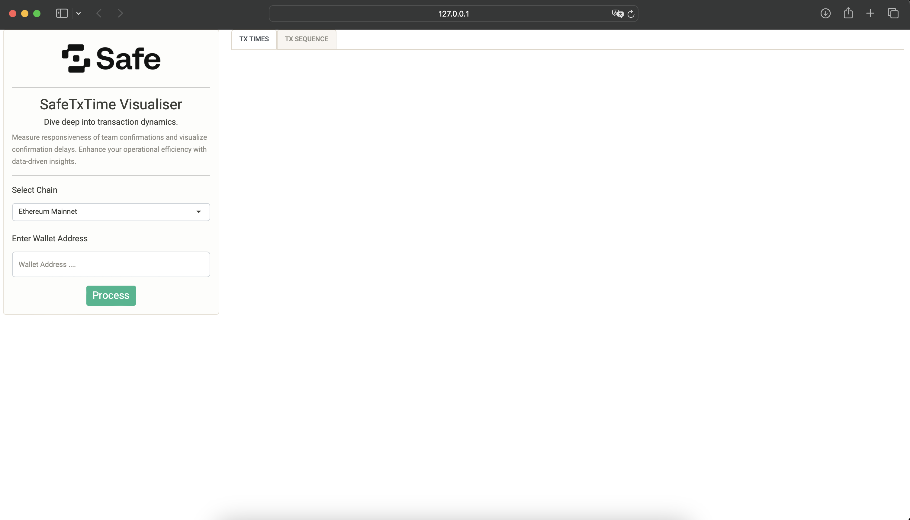
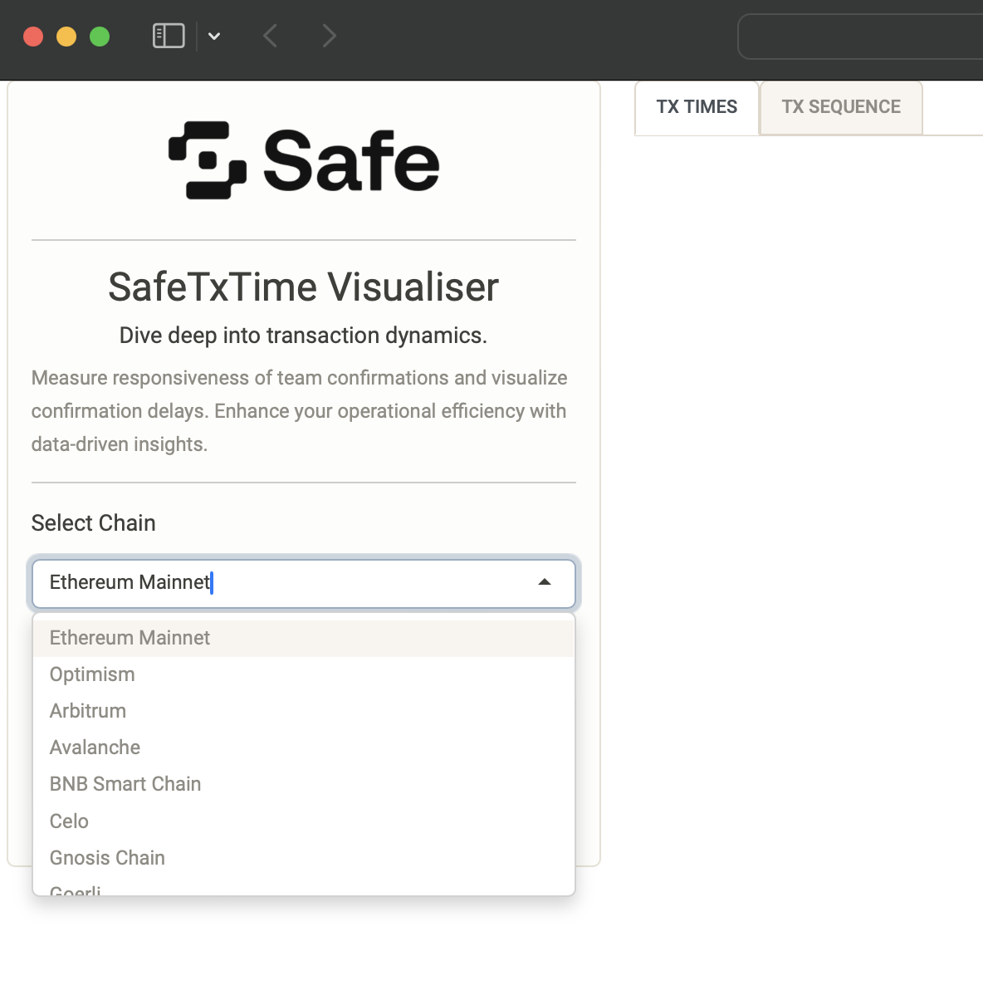
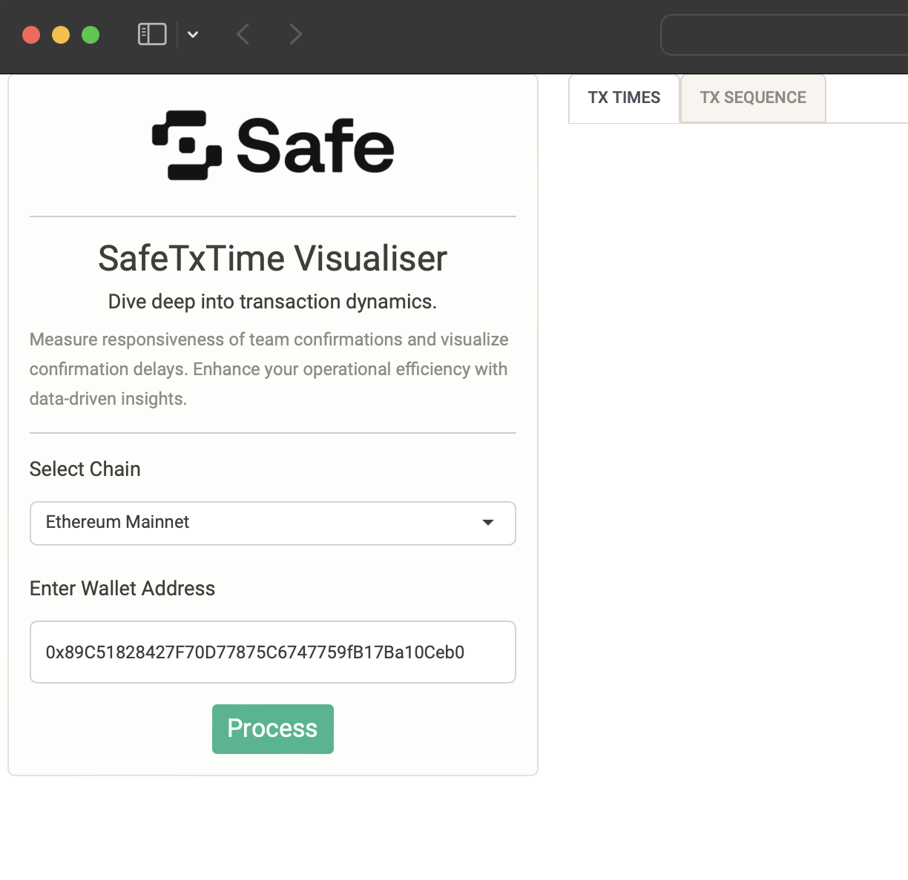
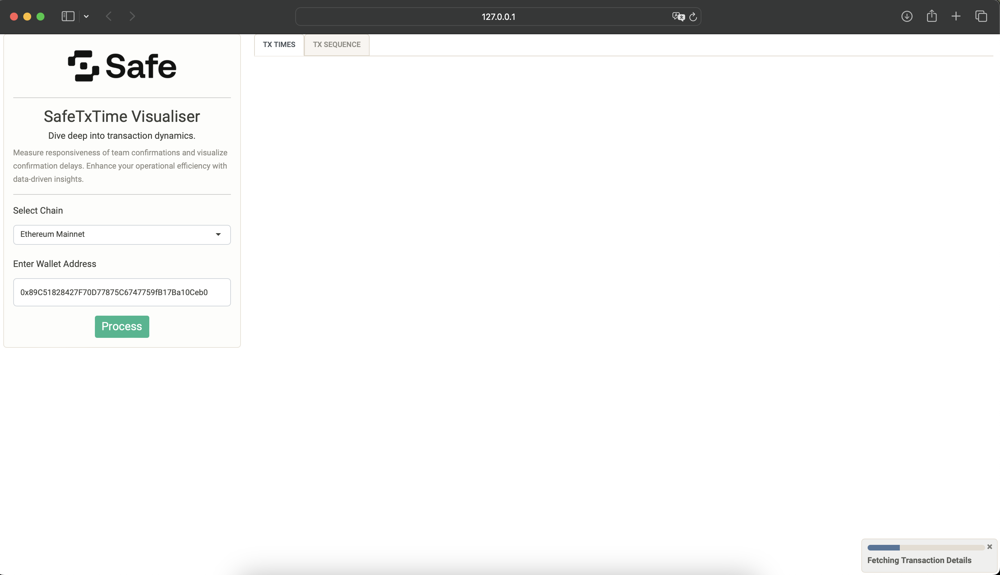
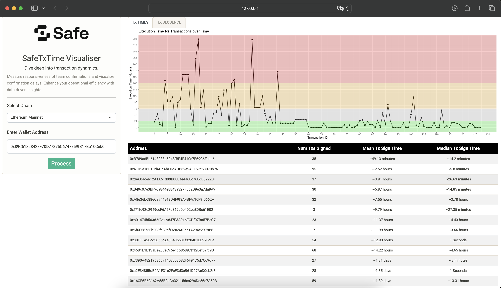
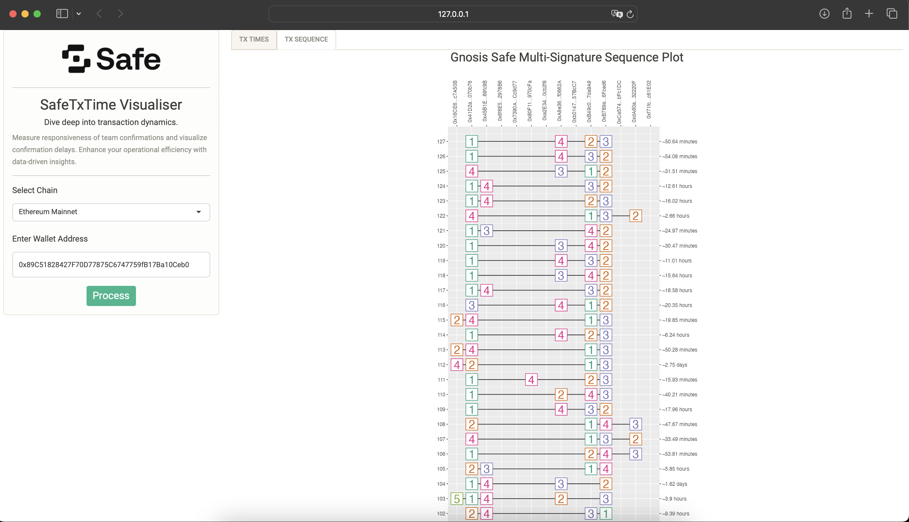

# SafeTxTimes
Safe Transaction Time Visualiser

## [App Walkthrough on YouTube](https://www.youtube.com/watch?v=56FW_N1-NS4) <<< Click Here

<hr>

### Walkthrough

#### 1. Open R and install the requirements using

```
install.packages("shiny")
install.packages("shinydashboard")
install.packages("shinycssloaders")
install.packages("shinyWidgets")
install.packages("ggplot2")
install.packages("httr")
install.packages("tidyr")
install.packages("lubridate")
install.packages("RColorBrewer")
install.packages("DT")
install.packages("readr")
```
#### 2. Clone this repo and set the R path to the repo.

```
setwd("~/Desktop/SafeTxTimes)
```

#### 3. Run the Shiny Dashboard

```
library(shiny)
runApp()
```


<div align="center">Dashboard</div>
<br>

#### 4. Select Chain and Enter Address and click Process

```
library(shiny)
runApp()
```


<div align="center">Select Chain</div>
<br>



<div align="center">Enter Address</div>
<br>

#### 4. Results



<div align="center">Pulling Data</div>
<br>


<div align="center">Tx Times</div>
<br>


<div align="center">Tx Sequence</div>
<br>

<hr>
